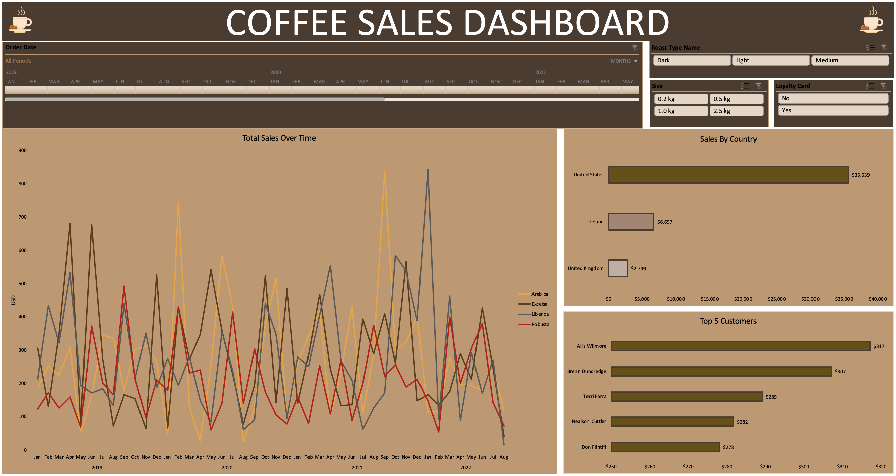

# Coffee Sales Dashboard

An interactive Microsoft Excel dashboard analyzing coffee sales from 2019 to 2022.

The dashboard allows users to explore sales performance by order date, roast type, bag size, and loyalty card status, with interactive visualizations for sales trends, geographic performance, and top customers.

**[View the interactive dashboard](https://1drv.ms/x/c/5ae3a254b04b4eeb/IQCMr31H_TBORLm9KDsSsTmZAXNYBWXUnDfwc1139jtaUpg?e=hcxx6P)**

The interactive version can be opened in a browser without requiring Excel to be installed.

---

## Dashboard Features

### Interactive Filters

- **Order Date Timeline:** Filter sales by month, quarter, or year
- **Roast Type:** Dark, Medium, Light
- **Bag Size:** 0.2 kg, 0.5 kg, 1.0 kg, 2.5 kg
- **Loyalty Card:** Yes / No

### Visualizations

- **Total Sales Over Time:** Monthly sales trends for Arabica, Excelsa, Liberica, and Robusta
- **Sales by Country:** Revenue comparison across the United States, Ireland, and the United Kingdom
- **Top 5 Customers:** Highest-spending customers by total sales

All visualizations update dynamically when filters are changed.

---

## Key Insights

- The **United States** is the largest market, generating approximately **$35.6K** in sales, compared with approximately **$9.5K combined** across Ireland and the United Kingdom.
- Monthly sales fluctuate substantially across the different coffee types, with leadership varying throughout the period.
- The five highest-spending customers generated approximately **$278–$317** each in sales.

---

## Technical Skills Demonstrated

- Microsoft Excel
- XLOOKUP
- INDEX/MATCH
- IF formulas
- Data validation and duplicate checking
- Excel Tables
- Pivot Tables
- Pivot Charts
- Slicers
- Timeline filters
- Data formatting
- Dashboard design
- Data visualization
- Interactive reporting

---

## Problems Solved

### XLOOKUP Compatibility

XLOOKUP returned `#NAME?` errors in my version of Excel. I replaced the XLOOKUP formulas with **INDEX/MATCH** to maintain equivalent lookup functionality and improve compatibility.

### Custom Timeline Styling on Mac

Excel for Mac provided limited options for editing timeline styles. I worked around this by modifying the workbook theme accent color, allowing the built-in timeline style to better match the dashboard's visual design.

---

## Files

| File | Description |
|---|---|
| `coffee_sales_dashboard.xlsx` | Full Excel workbook containing the source data, calculations, Pivot Tables, Pivot Charts, and dashboard |
| `dashboard.png` | Dashboard preview |

---

## How to Use

1. Open the **[interactive dashboard](https://1drv.ms/x/c/5ae3a254b04b4eeb/IQCMr31H_TBORLm9KDsSsTmZAXNYBWXUnDfwc1139jtaUpg?e=hcxx6P)** in your browser, or download `coffee_sales_dashboard.xlsx`.
2. Use the timeline and slicers to filter the dashboard.
3. Select different roast types, bag sizes, loyalty-card statuses, or time periods to explore the data.
4. Use the clear-filter icon on a slicer to reset a selection.

---

**Tools:** Microsoft Excel · Formulas · Tables · Pivot Tables · Pivot Charts · Slicers · Timelines
